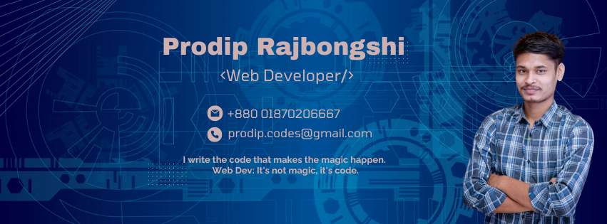

<!-- ========================================================= -->
<!--                        HEADER                             -->
<!-- ========================================================= -->

  

 

<h1 align="center">
  Hi This is Prodip Rajbongshi
</h1>

  <strong>Full-Stack Web Developer</strong>
  &nbsp;•&nbsp;
  <strong>CSE Graduate</strong>
  &nbsp;•&nbsp;
  <strong>MERN Stack Developer</strong>

  
 
  
 
  

 

  

 

---

# 👨‍💻 About Me

<table>
<tr>
<td>

I'm **Prodip Rajbongshi**, a CSE graduate and passionate **Full-Stack Web Developer from Bangladesh**.

I enjoy transforming ideas into modern, scalable, and user-friendly web applications. My main focus is building responsive frontend experiences with React and developing reliable backend systems using Node.js, Express, and MongoDB.

</td>
</tr>
</table>

 

### 💻 What I Focus On

<table>
<tr>
<td align="center" width="33%">

### 💻

**Full-Stack Web Development**

</td>

<td align="center" width="33%">

### 🎨

**Modern UI/UX Implementation**

</td>

<td align="center" width="33%">

### ⚡

**Performance & Responsive Design**

</td>
</tr>

<tr>
<td align="center">

### 🔐

**REST API & Backend Development**

</td>

<td align="center">

### 🗄️

**Database Integration**

</td>

<td align="center">

### 🚀

**Deployment & Version Control**

</td>
</tr>
</table>

 

### 🚀 Currently

<table>
<tr>
<td width="50%">

🔭 **Currently working on**

Full-Stack Web Applications

</td>

<td width="50%">

🌱 **Currently learning**

NestJS & AWS

</td>
</tr>

<tr>
<td width="50%">

💡 **Interested in**

Web Development, UI/UX & Software Engineering

</td>

<td width="50%">

👨‍💻 **Portfolio**

<a href="https://portfolio-two-chi-18.vercel.app/" target="_blank">
Portfolio
</a>

</td>
</tr>

<tr>
<td width="50%">

📫 **Email**

<a href="mailto:prodip.code@gmail.com">
prodip.code@gmail.com
</a>

</td>

<td width="50%">

⚡ **Fun fact**

I enjoy turning ideas into clean and interactive digital experiences.

</td>
</tr>
</table>

---

# 🧩 What I Do

<table>
<tr>

<td width="50%" valign="top">

## 🌐 Web Development

Building modern, responsive and scalable websites and web applications using modern technologies.

</td>

<td width="50%" valign="top">

## ⚛️ Frontend Development

Creating interactive user interfaces with React, Next.js, Tailwind CSS and modern JavaScript.

</td>

</tr>

<tr>

<td width="50%" valign="top">

## 🛠️ Backend Development

Developing REST APIs and server-side applications using Node.js, Express.js and MongoDB.

</td>

<td width="50%" valign="top">

## 🎨 UI/UX Implementation

Turning Figma and design concepts into responsive and polished web interfaces.

</td>

</tr>
</table>

---

# 🛠️ Tech Stack

## 🚀 Frontend Development

  

---

## ⚙️ Backend Development

  

---

## 🧰 Tools & Technologies

  

---

# 📌 Featured Work

Here are some of the areas I work on:

 

<table>
<thead>
<tr>
<th align="left">Project Type</th>
<th align="left">Technologies</th>
</tr>
</thead>

<tbody>

<tr>
<td>🌐 Business Websites</td>
<td>React, Tailwind CSS, JavaScript</td>
</tr>

<tr>
<td>🛒 E-Commerce Applications</td>
<td>MERN Stack</td>
</tr>

<tr>
<td>📊 Dashboard Applications</td>
<td>React, REST API</td>
</tr>

<tr>
<td>🔐 Authentication Systems</td>
<td>Node.js, Express, MongoDB</td>
</tr>

<tr>
<td>📱 Responsive Web Applications</td>
<td>React, Next.js</td>
</tr>

<tr>
<td>🎨 UI/UX Implementations</td>
<td>Figma, React, Tailwind</td>
</tr>

</tbody>
</table>

 

  <strong>More projects and case studies are available on my portfolio.</strong>

  

---

# 📊 GitHub Statistics

  

  &nbsp;&nbsp;

  

---

# 🔥 GitHub Streak

  

